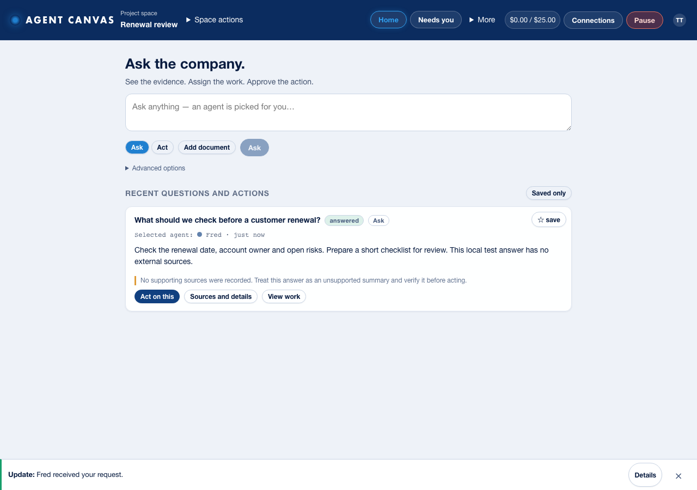

# Agent Canvas UI release — approval review, 2026-09-14

**Release update:** the final reviewed image was deployed on 2026-09-14 under Pete’s approval. The earlier candidate below was superseded; use the [finalization record](2026-09-14-finalization.md) for its digest, revision and observed results.

**Prepared locally. Not published or deployed.** This is the exact package for
Pete's deployment decision. No branch push, provider change, new permission,
backend change or external business-system write is included.

**Completion audit closed:** all three implementation gaps are fixed and verified
locally. [Audit and closure evidence](2026-09-14-simplification-audit.md) record the
regressions. The refreshed image below supersedes the earlier `a2d4b21` snapshot.

## What the team gets

- Home and Needs you lead navigation; one composer defaults to Ask.
- Act on this carries an answer into an editable, removable follow-up context.
- Needs you collects accessible project spaces, retains answers and prevents
  duplicate submissions across navigation.
- Failed saves, unavailable sources and stale connection checks explain the
  problem and provide recovery. Memory history and review context are readable.
- Rooms, scheduled work, team and documents remain available under More;
  technical controls remain reachable under Advanced or existing owner areas.

The [guide](../../USER-GUIDE.md), [complete control map](../SIMPLIFICATION.md)
and [browser evidence](../UI-TESTING.md) describe the resulting behavior.



## Exact candidate

| Item | Prepared value |
|---|---|
| Source base | `1dc6cab5fcdb1a084ab9a054d22ca9de7ab78792` plus the verified completion follow-up; exact snapshot hashes are in the JSON record |
| Local image | `agent-canvas:ui-20260914-69cf8d9` |
| Proposed registry tag | `us-central1-docker.pkg.dev/agent-canvas-ctg-0811/app/agent-canvas:ui-20260914-69cf8d9` |
| Image index digest | `sha256:8098492a51436b2806103d5e283292d758334121b7ad5bf41fa3acf41193b390` |
| Linux/amd64 manifest | `sha256:9f3e319e97882570a7b249df7bdb9d2b54dcf97b63f87b13278d041cc9c9ad80` |
| Build-input manifest SHA-256 | `69cf8d9cc9d8a36b8d1f370cc9ca98a7df8d4305067c8bcf67a0bc34fc98dc02` |
| Node runtime | `22.23.2`, matching the observed live image |

The local package directory is
`/Users/cpconnor/projects/second-brain/agent-canvas/.release/2026-09-14-ui-completion-69cf8d9`.
It contains an image archive, source snapshot, restricted build context,
`SHA256SUMS`, build log, source manifest and container checks. The build context
contains 86 explicitly inventoried files, excluding credentials, databases,
untracked material and test fixtures. The source archive retains tests and
documentation for review. The image contains no fixture runner or development
sign-in capability in production.

The 314-file source snapshot includes the completion fixes, tests, guide and
inspected evidence. Exact content hashes identify the release. Pete approved
preserving the stale shared Git lock as a timestamped backup and committing only
Agent Canvas changes. The release review pair sits alongside the frozen source
archive, avoiding self-referencing archive hashes. [Machine-readable evidence](2026-09-14-ui.json) records the
archive hashes and live baseline. Private recovery files are excluded from
every archive and are not committed. Pete explicitly approved this private
restore test; its successful result is in the evidence record.

## Verification

| Gate | Result |
|---|---|
| Full application verification | Passed: 433 backend + 292 frontend tests, build and deploy preflight |
| Production dependency audits | Root and frontend both clean |
| Browser coverage | All 15 groups pass; 390/768/1280px, keyboard and 200% zoom evidence retained |
| Guide-only journeys | Automated member desktop/mobile and Pete owner journeys avoid Advanced/owner settings |
| Existing behavior contract | All 63 original test files retained; no new skipped tests |
| Container build | Passed, Linux/amd64, pinned official Node base |
| Packaged UI | Byte-for-byte match with the tested frontend build |
| Packaged backend | All 40 source files and startup script match the live image; only live Finder metadata is absent |
| Offline production startup | Healthy; all eight workspace-content counts zero; private route returns 401 |
| Production development sign-in | Correct route returns 403 with no session, even with `DEV_AUTH=1` supplied |
| Installed dependency fixes | XML parser 0.8.15, body-parser 1.20.8, qs 6.16.0 |
| Database restore check | Passed at 16:14 UTC: integrity OK, required tables present; offline, no application started |

Fixtures do not verify Google OAuth, live integrations, physical microphone
behavior or an unaided teammate walkthrough. The container and read-only live
checks do not turn those limits into passed tests.

## Live baseline and rollback compatibility

Read-only observation at **2026-09-14 15:56 UTC**:

- Project `agent-canvas-ctg-0811`, region `us-central1`, service `agent-canvas`.
- `agent-canvas-00071-p26` serves 100% of traffic, service generation 71.
- Health returns 200 and `paused:false`; development sign-in is disabled.
- Gemini remains configured, using 2.5 Flash/Pro. No tier override is introduced.
- Runtime remains 1 CPU, 1 GiB, concurrency 80, timeout 300 seconds and a
  revision maximum of one instance; existing service account and all 18
  environment/secret bindings are preserved.
- Standing-rules Scheduler is enabled. Its existing schedule stays unchanged.
- Existing replica generation `a439d8eb147614d1` has a snapshot and recent WAL
  objects. Metadata presence alone does not prove a successful restore.

The exact rollback image is
`us-central1-docker.pkg.dev/agent-canvas-ctg-0811/app/agent-canvas@sha256:724c1ea64436f738eb7cc775c1b6826f11eeef0145ae856c3e932bc3d724d63f`.
Backend equality confirms this release introduces no schema/reader change.
Rollback must use **00071-p26**, never an older pre-cleanup revision.

## Approval scope and rollout procedure

Deployment approval covers publishing this exact image to the existing private
registry, a temporary service/Scheduler pause, a fresh recovery check, the
image-only update, verification and restoration of the previous operating state.
It does not authorize CRM changes, email sending, new integrations or Git pushes.

A short maintenance window is necessary for the existing database arrangement.
Cloud Run can overlap revision instances during deployment even with a
revision maximum of one. The procedure therefore stops the old instances before
starting the candidate; it does not use a traffic split or a preview revision
against the production replica. [Cloud Run autoscaling](https://docs.cloud.google.com/run/docs/about-instance-autoscaling),
[manual scaling and disabling a service](https://docs.cloud.google.com/run/docs/configuring/services/manual-scaling#disable).

**Do not execute the following until Pete approves deployment.**

1. Recheck the service generation, revision, traffic, configuration fingerprint,
   scheduled job, image digest and replica availability against the JSON record.
   If anything changed, reconcile it before proceeding. Verify `SHA256SUMS` and
   inspect the local image digest. The approved private restore check passed at 16:14 UTC; repeat it against a fresh recovery copy during the approved maintenance window.
2. Publish the already-tested image under the unique tag and verify the registry
   returns the expected index digest. Do not rebuild or use `:latest`.

```bash
docker tag agent-canvas@sha256:8098492a51436b2806103d5e283292d758334121b7ad5bf41fa3acf41193b390 \
  us-central1-docker.pkg.dev/agent-canvas-ctg-0811/app/agent-canvas:ui-20260914-69cf8d9
docker push us-central1-docker.pkg.dev/agent-canvas-ctg-0811/app/agent-canvas:ui-20260914-69cf8d9
docker buildx imagetools inspect \
  us-central1-docker.pkg.dev/agent-canvas-ctg-0811/app/agent-canvas:ui-20260914-69cf8d9
```

3. As Pete, use the app's Pause control. Pause the existing scheduled job and
   temporarily disable the service. Confirm no tagged revisions exist and wait
   for all old instances and pending requests to stop; elapsed time alone is
   not proof. Confirm final replication, retain a fresh private recovery copy
   and verify its restore before proceeding.

```bash
gcloud scheduler jobs pause agent-canvas-standing-rules \
  --project agent-canvas-ctg-0811 --location us-central1
gcloud run services update agent-canvas \
  --project agent-canvas-ctg-0811 --region us-central1 --scaling=0
```

4. With the service still disabled, update only the image and revision name.
   Recheck all environment/secret references, runtime limits, service account
   and replication destination against the baseline before enabling traffic.

```bash
gcloud run services update agent-canvas \
  --project agent-canvas-ctg-0811 --region us-central1 \
  --image us-central1-docker.pkg.dev/agent-canvas-ctg-0811/app/agent-canvas@sha256:8098492a51436b2806103d5e283292d758334121b7ad5bf41fa3acf41193b390 \
  --revision-suffix ui-20260914-69cf8d9 --no-traffic --scaling=0
gcloud run services update-traffic agent-canvas \
  --project agent-canvas-ctg-0811 --region us-central1 \
  --to-revisions agent-canvas-ui-20260914-69cf8d9=100
gcloud run services update agent-canvas \
  --project agent-canvas-ctg-0811 --region us-central1 --scaling=auto
```

5. Confirm the serving revision/digest, health, restored database, disabled dev
   sign-in and expected frontend assets. Inspect signed-in Home, Needs you,
   connection status and source navigation as Pete, without resolving someone
   else's real decision or creating fixture records. A failed connector must
   remain visibly failed. Inspect startup/error/replication logs.
6. Once the release checks pass, restore the previous app Pause state and resume
   the existing Scheduler only if it was enabled before maintenance. Verify the
   next scheduled tick. Update HANDOFF with the actual revision and observed
   live results; retain any unverified integration/teammate acceptance items.

Do not use `deploy/deploy.sh` as a read-only preflight: its dry-run flag stops
only the final service update, after provisioning, IAM/secret work and an image
upload. This release uses the narrower commands above and changes none of that
configuration.

## Rollback

If startup, authentication, data visibility or navigation fails, keep scheduled
work paused. Pause the app if available, disable the service again, confirm
candidate instances have stopped and check the latest replica. Then route all
traffic to the compatible previous revision and restore automatic scaling:

```bash
gcloud run services update agent-canvas \
  --project agent-canvas-ctg-0811 --region us-central1 --scaling=0
# After shutdown and replica checks:
gcloud run services update-traffic agent-canvas \
  --project agent-canvas-ctg-0811 --region us-central1 \
  --to-revisions agent-canvas-00071-p26=100
gcloud run services update agent-canvas \
  --project agent-canvas-ctg-0811 --region us-central1 --scaling=auto
```

Recheck health, authentication and data before restoring the prior app/Scheduler
state. Restore from the latest replica on cold start; do not replace newer
workspace data with the pre-release copy. Any destructive data restoration
requires a separate decision. A failed shutdown or recovery check is a stop
condition, not permission to run two writers.
